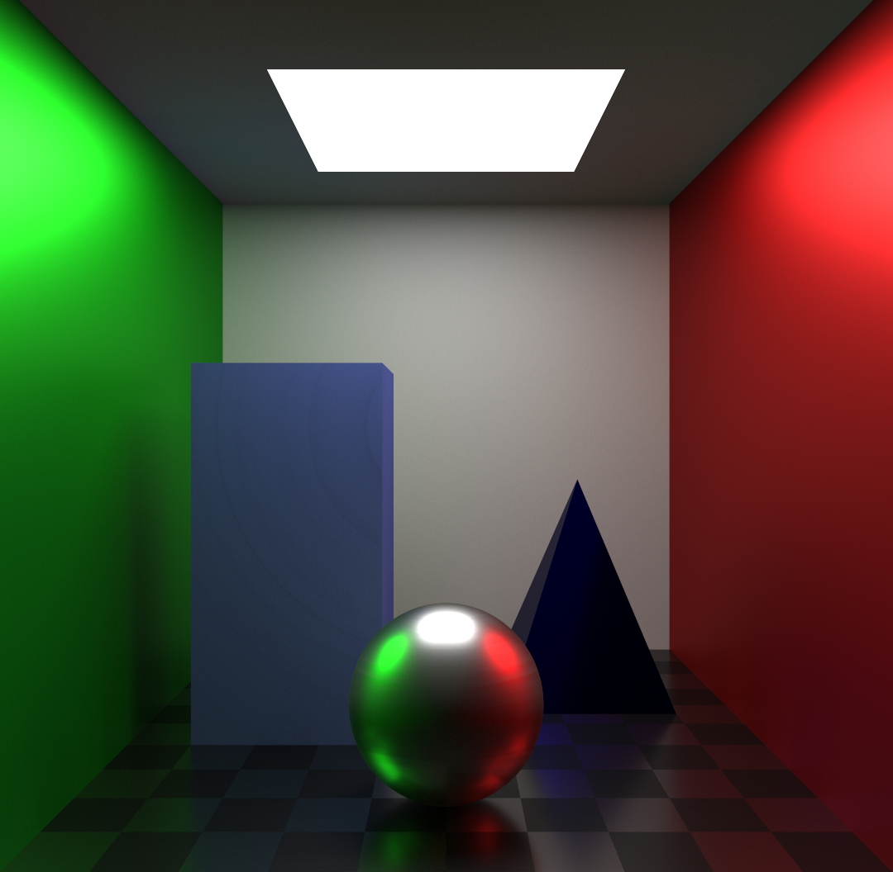
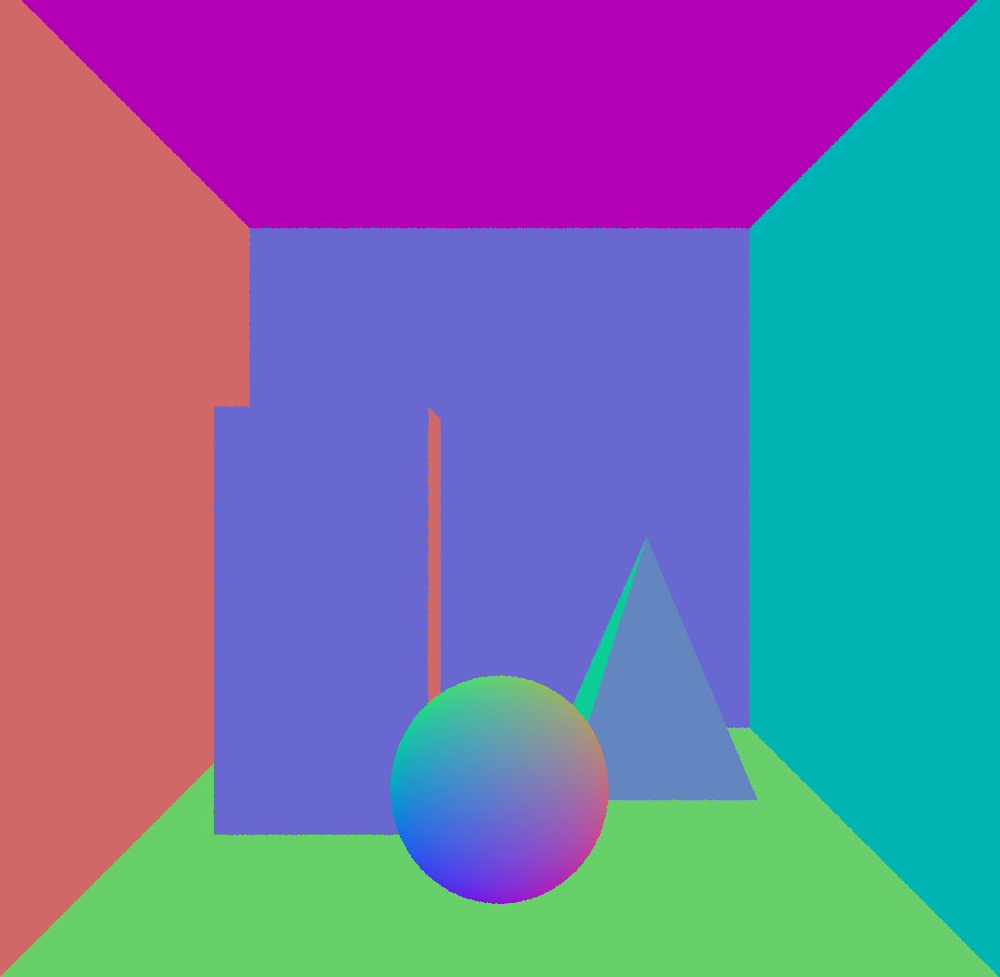
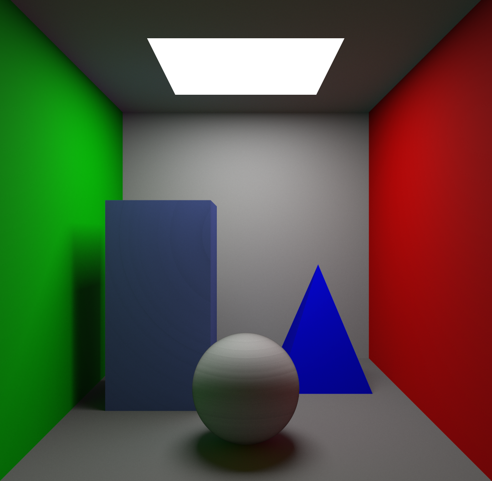
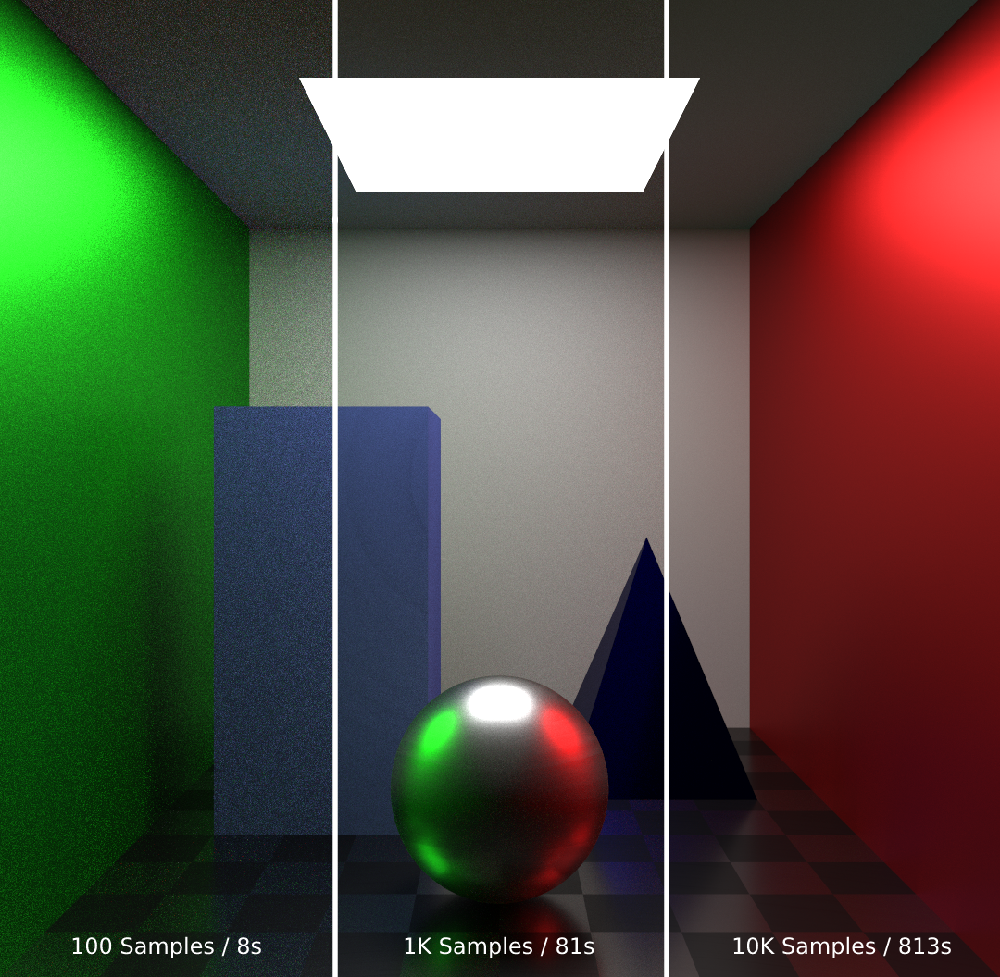

# Ray Tracer
A minimal GPU accelerated ray tracer written in OpenGL.

<figure>
  <div style="display: flex; justify-content: center">
    
  </div>
  <figcaption style="text-align:center">10k Samples / 813 Seconds</figcaption>
</figure>

## Features:
- Next event estimation
- GGX microfacet model for variable roughness
- Sampling of visible normal distribution function
- Progressive rendering
- BVH acceleration

## Screenshots
<figure>
  <div style="display: flex; justify-content: space-around">
    
    
    
  </div>
  <figcaption style="text-align:center"><b>Left:</b> Normals, <b>Middle:</b> Diffuse, <b>Right:</b> Quality vs Samples</figcaption>
</figure>

## Requirements
- CMake
- GPU with OpenGL (>= 4.6) support
- GLFW (already included)
- GLAD (aldreay included)
- STB (already included)

## Build
```bash
mkdir build
cd build
cmake ..
make
```

## Usage
```bash
raytracer <NUM_SAMPLES> <IMAGE_SIZE> <IMAGE_PATH>
```

## TODO:
- [ ] SVGF denoising
- [ ] Transmissive materials (glass, water etc.)
- [ ] Allow importing OBJ files
- [ ] Bidirectional path tracing
- [ ] Move to Vulkan and use hardware ray tracing acceleration

## Known Issues
- There are some ringing artifacts on the left Cuboid and the Sphere (see [diffuse.png](./media/diffuse.png)).
- Using BVH is actually slower than not using it (11s vs 8s for 100 samples).
